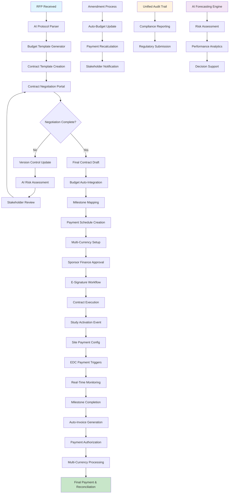
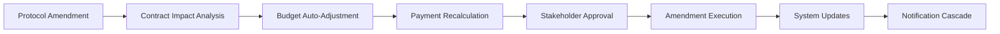

# Contract-to-Payment Workflow Map
## Complete End-to-End Financial Orchestration



## Detailed Workflow Phases

### **Phase 1: RFP & Initial Setup (Days 1-3)**

#### **Step 1.1: RFP Processing**
```typescript
// Event: RFP received
{
  eventType: 'rfp.received',
  payload: {
    rfpId: 'RFP-2024-001',
    sponsorId: 'sponsor-123',
    studyType: 'Phase III Oncology',
    estimatedParticipants: 500,
    estimatedSites: 25,
    therapeuticArea: 'oncology'
  }
}
```

#### **Step 1.2: AI Protocol Analysis**
- **AI Engine** parses protocol document
- Extracts key parameters: visits, procedures, timelines
- Generates cost estimates based on historical data
- Creates initial budget framework

#### **Step 1.3: Template Generation**
- **Contract Service** selects appropriate MSA template
- **Budget Service** applies rate cards and benchmarks
- **AI Engine** suggests optimal payment milestones
- Templates personalized based on sponsor preferences

---

### **Phase 2: Contract Negotiation (Days 4-14)**

#### **Step 2.1: Negotiation Portal**
```typescript
// Negotiation workflow
interface NegotiationWorkflow {
  contractId: string;
  currentVersion: number;
  stakeholders: {
    sponsorContractManager: User;
    croContractManager: User;
    croLegalOfficer: User;
    sponsorLegal: User;
  };
  negotiationPoints: {
    clauseId: string;
    originalText: string;
    proposedText: string;
    status: 'pending' | 'accepted' | 'rejected';
    comments: Comment[];
  }[];
}
```

#### **Step 2.2: AI Risk Assessment**
- **AI Engine** analyzes each contract clause
- Identifies high-risk terms (liability, payment, IP)
- Provides risk scores and mitigation suggestions
- Tracks negotiation patterns for future optimization

#### **Step 2.3: Version Control**
- Every change tracked with detailed diff
- Automatic stakeholder notifications
- Parallel budget impact analysis
- Real-time collaboration tools

---

### **Phase 3: Budget Integration (Days 10-12)**

#### **Step 3.1: Automatic Budget Sync**
```sql
-- Budget integration trigger
CREATE TRIGGER contract_budget_sync
AFTER UPDATE ON contracts
FOR EACH ROW
WHEN NEW.status = 'negotiation_complete'
EXECUTE FUNCTION sync_budget_with_contract();
```

#### **Step 3.2: Milestone Mapping**
- **Financial Orchestration Engine** maps contract terms to operational milestones
- Creates payment triggers linked to EDC events
- Establishes multi-currency payment schedules
- Configures site-specific payment rules

#### **Step 3.3: Global Payment Setup**
```typescript
// Multi-currency configuration
interface GlobalPaymentSetup {
  studyId: string;
  baseCurrency: 'USD';
  siteConfigurations: {
    [siteId: string]: {
      localCurrency: string;
      vatRate: number;
      paymentMethod: 'wire' | 'ach' | 'local_bank';
      splitPayees?: PayeeConfig[];
    };
  };
}
```

---

### **Phase 4: Approval & Execution (Days 13-16)**

#### **Step 4.1: Sponsor Finance Approval**
- **Sponsor Finance Manager** reviews final budget
- AI provides cost comparison with similar studies
- Approval workflow with electronic signatures
- Automatic budget lock upon approval

#### **Step 4.2: Contract Execution**
```typescript
// E-signature workflow
interface ESignatureProcess {
  contractId: string;
  signatories: {
    sponsorSignatory: User;
    croSignatory: User;
    witnessRequired: boolean;
  };
  signatureOrder: 'sequential' | 'parallel';
  completionCallback: 'study_activation';
}
```

#### **Step 4.3: Study Activation**
- Contract execution triggers study activation event
- **CTMS** receives activation signal
- Site payment configurations deployed
- EDC payment triggers activated

---

### **Phase 5: Operational Integration (Days 17-21)**

#### **Step 5.1: Site Payment Configuration**
```typescript
// Site-specific payment setup
interface SitePaymentConfig {
  siteId: string;
  paymentModel: 'visit_based' | 'procedure_based';
  rates: {
    screeningVisit: 500;
    baselineVisit: 800;
    followupVisit: 600;
    adverseEventReport: 200;
  };
  milestones: {
    firstPatientIn: 5000;
    lastPatientLastVisit: 3000;
  };
}
```

#### **Step 5.2: EDC Integration**
- **EDC Engine** configured with payment triggers
- Visit completion automatically triggers payment calculation
- Procedure completion tracked for procedure-based payments
- Real-time payment status updates

---

### **Phase 6: Payment Processing (Ongoing)**

#### **Step 6.1: Milestone Detection**
```typescript
// EDC event triggers payment
{
  eventType: 'visit.completed',
  payload: {
    visitId: 'visit-123',
    participantId: 'participant-456',
    siteId: 'site-789',
    studyId: 'study-001',
    completedProcedures: ['physical_exam', 'lab_draw', 'ecg'],
    completionDate: '2024-02-18T14:30:00Z'
  }
}
```

#### **Step 6.2: Auto-Invoice Generation**
- **Financial Orchestration Engine** calculates payment
- Multi-currency conversion applied
- VAT/tax calculations included
- Invoice generated and queued for approval

#### **Step 6.3: Payment Authorization**
```sql
-- Payment authorization workflow
INSERT INTO site_payments (
  visit_id, site_id, study_id, base_amount, currency,
  local_amount, vat_amount, total_amount, status
) VALUES (
  'visit-123', 'site-789', 'study-001', 800.00, 'USD',
  740.00, 148.00, 888.00, 'pending_approval'
);
```

#### **Step 6.4: Final Payment & Reconciliation**
- **Payment Service** processes approved payments
- Multi-currency transfers executed
- Automatic reconciliation with bank feeds
- Payment confirmation to all stakeholders

---

## Amendment Workflow

### **Amendment Processing**


#### **Automatic Propagation**
1. **Protocol change** detected in study management
2. **AI Engine** analyzes impact on contract terms
3. **Budget Service** recalculates affected line items
4. **Payment Service** adjusts future payment schedules
5. **Notification Service** alerts all stakeholders
6. **Version Control** maintains complete audit trail

---

## Real-Time Monitoring & Analytics

### **Financial Dashboard Updates**
```typescript
// Real-time financial metrics
interface FinancialMetrics {
  portfolioLevel: {
    totalCommittedBudget: number;
    actualSpend: number;
    forecastAccuracy: number;
    paymentVelocity: number;
  };
  studyLevel: {
    budgetUtilization: number;
    milestoneCompletion: number;
    sitePerformance: SiteMetrics[];
  };
  siteLevel: {
    pendingPayments: number;
    paymentTimeliness: number;
    visitCompletionRate: number;
  };
}
```

### **Predictive Analytics**
- **AI Forecasting Engine** continuously updates predictions
- Risk assessment based on actual vs. planned performance
- Early warning system for budget overruns
- Optimization suggestions for payment schedules

---

## Compliance & Audit Trail

### **Unified Audit Schema**
```sql
-- Complete audit trail across all systems
SELECT 
  fal.timestamp,
  fal.event_type,
  fal.user_id,
  u.display_name,
  fal.object_type,
  fal.object_id,
  fal.old_values,
  fal.new_values,
  fal.reason
FROM financial_audit_logs fal
JOIN users u ON fal.user_id = u.id
WHERE fal.object_id = 'contract-123'
ORDER BY fal.timestamp;
```

### **Regulatory Compliance**
- **21 CFR Part 11** electronic signatures and audit trails
- **GDPR** data protection and privacy controls
- **SOX** financial controls and segregation of duties
- **GCP** good clinical practice compliance

---

## Key Performance Indicators

### **Workflow Efficiency Metrics**
- **Contract Negotiation Time**: Target <14 days
- **Budget Approval Cycle**: Target <3 days  
- **Payment Processing Time**: Target <5 days
- **Amendment Processing**: Target <2 days
- **System Uptime**: Target >99.9%

### **Financial Performance Metrics**
- **Budget Accuracy**: Actual vs. planned variance <5%
- **Payment Timeliness**: >95% on-time payments
- **Forecast Accuracy**: >90% accuracy at 6-month horizon
- **Cost Per Participant**: Benchmarked against industry

This complete workflow demonstrates how hypatiaOS orchestrates the entire contract-to-payment lifecycle with unprecedented automation, transparency, and compliance.
