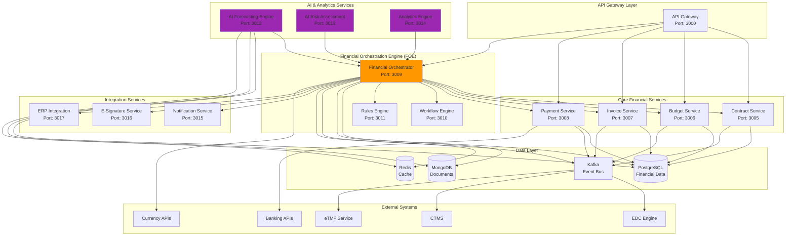
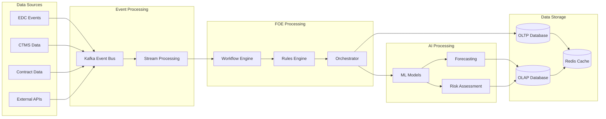

# Financial Orchestration Engine (FOE) & AI Forecasting Technical Design

## 🏗️ Microservices Architecture Overview



---

## 🎯 Financial Orchestration Engine (FOE) Architecture

### **Core Components**

#### **1. Financial Orchestrator Service**
```typescript
// Financial Orchestrator - Main coordination service
@Service('financial-orchestrator')
export class FinancialOrchestrator {
  
  @EventHandler('contract.negotiation_complete')
  async handleContractNegotiationComplete(event: ContractEvent) {
    // Orchestrate the contract-to-budget-to-payment workflow
    const workflow = await this.workflowEngine.createWorkflow({
      type: 'contract_to_payment_setup',
      contractId: event.contractId,
      steps: [
        'validate_contract',
        'sync_budget',
        'setup_payment_schedules',
        'configure_site_payments',
        'activate_edc_triggers'
      ]
    });
    
    return await this.workflowEngine.execute(workflow);
  }
  
  @EventHandler('milestone.completed')
  async handleMilestoneCompleted(event: MilestoneEvent) {
    // Orchestrate payment processing
    const paymentWorkflow = await this.createPaymentWorkflow(event);
    return await this.processPayment(paymentWorkflow);
  }
  
  private async createPaymentWorkflow(event: MilestoneEvent) {
    return {
      type: 'milestone_payment',
      steps: [
        'validate_milestone',
        'calculate_payment',
        'apply_currency_conversion',
        'generate_invoice',
        'route_for_approval',
        'process_payment',
        'update_reconciliation'
      ]
    };
  }
}
```

#### **2. Workflow Engine**
```typescript
// Workflow Engine - Manages complex multi-step processes
@Service('workflow-engine')
export class WorkflowEngine {
  
  async createWorkflow(definition: WorkflowDefinition): Promise<Workflow> {
    const workflow = new Workflow({
      id: uuidv4(),
      type: definition.type,
      status: 'created',
      steps: definition.steps.map(step => ({
        name: step,
        status: 'pending',
        retryCount: 0,
        maxRetries: 3
      })),
      context: definition.context || {},
      createdAt: new Date()
    });
    
    await this.workflowRepository.save(workflow);
    return workflow;
  }
  
  async execute(workflow: Workflow): Promise<WorkflowResult> {
    for (const step of workflow.steps) {
      try {
        const result = await this.executeStep(workflow, step);
        step.status = 'completed';
        step.result = result;
        
        // Publish step completion event
        await this.eventBus.publish(`workflow.step.completed`, {
          workflowId: workflow.id,
          stepName: step.name,
          result
        });
        
      } catch (error) {
        step.status = 'failed';
        step.error = error.message;
        step.retryCount++;
        
        if (step.retryCount < step.maxRetries) {
          // Schedule retry
          await this.scheduleRetry(workflow, step);
        } else {
          // Mark workflow as failed
          workflow.status = 'failed';
          break;
        }
      }
    }
    
    if (workflow.steps.every(step => step.status === 'completed')) {
      workflow.status = 'completed';
    }
    
    await this.workflowRepository.update(workflow);
    return { workflow, success: workflow.status === 'completed' };
  }
  
  private async executeStep(workflow: Workflow, step: WorkflowStep): Promise<any> {
    const handler = this.stepHandlers.get(step.name);
    if (!handler) {
      throw new Error(`No handler found for step: ${step.name}`);
    }
    
    return await handler.execute(workflow.context);
  }
}
```

#### **3. Rules Engine**
```typescript
// Rules Engine - Business logic and validation
@Service('rules-engine')
export class RulesEngine {
  
  async evaluatePaymentRules(paymentRequest: PaymentRequest): Promise<PaymentDecision> {
    const rules = await this.getRulesForStudy(paymentRequest.studyId);
    const context = await this.buildRuleContext(paymentRequest);
    
    const decisions: RuleDecision[] = [];
    
    for (const rule of rules) {
      const decision = await this.evaluateRule(rule, context);
      decisions.push(decision);
      
      if (decision.action === 'block') {
        return {
          approved: false,
          reason: decision.reason,
          requiredActions: decision.requiredActions
        };
      }
    }
    
    return {
      approved: true,
      decisions,
      calculatedAmount: context.calculatedAmount,
      currency: context.currency
    };
  }
  
  private async evaluateRule(rule: BusinessRule, context: RuleContext): Promise<RuleDecision> {
    // Rule evaluation logic
    switch (rule.type) {
      case 'budget_limit_check':
        return this.evaluateBudgetLimit(rule, context);
      case 'milestone_validation':
        return this.evaluateMilestoneCompletion(rule, context);
      case 'currency_compliance':
        return this.evaluateCurrencyCompliance(rule, context);
      default:
        return { action: 'allow', reason: 'No applicable rule' };
    }
  }
}
```

---

## 🤖 AI Forecasting Engine Architecture

### **Core AI Components**

#### **1. Forecasting Engine**
```typescript
// AI Forecasting Engine - Predictive analytics and scenario modeling
@Service('ai-forecasting-engine')
export class AIForecastingEngine {
  
  private models: Map<string, MLModel> = new Map();
  
  async generateStudyForecast(
    studyId: string, 
    scenarios: ForecastScenario[]
  ): Promise<ForecastResult> {
    
    // Get historical data for model training
    const historicalData = await this.getHistoricalData(studyId);
    const studyCharacteristics = await this.getStudyCharacteristics(studyId);
    
    // Load or train appropriate model
    const model = await this.getOrTrainModel(studyCharacteristics);
    
    const forecasts: ScenarioForecast[] = [];
    
    for (const scenario of scenarios) {
      const forecast = await this.runScenarioForecast(model, scenario, historicalData);
      forecasts.push(forecast);
    }
    
    // Calculate ensemble predictions
    const ensembleForecast = this.calculateEnsemble(forecasts);
    
    // Store results for caching
    await this.storeForecastResults(studyId, forecasts, ensembleForecast);
    
    return {
      studyId,
      scenarios: forecasts,
      ensemble: ensembleForecast,
      confidence: this.calculateConfidence(forecasts),
      generatedAt: new Date()
    };
  }
  
  private async runScenarioForecast(
    model: MLModel, 
    scenario: ForecastScenario, 
    historicalData: HistoricalData
  ): Promise<ScenarioForecast> {
    
    // Prepare feature vectors
    const features = this.prepareFeatures(scenario, historicalData);
    
    // Run Monte Carlo simulation
    const simulations = await this.runMonteCarloSimulation(model, features, 1000);
    
    // Calculate statistics
    const statistics = this.calculateStatistics(simulations);
    
    return {
      scenarioName: scenario.name,
      predictions: {
        totalCost: statistics.totalCost,
        enrollmentTimeline: statistics.enrollmentTimeline,
        paymentSchedule: statistics.paymentSchedule,
        riskFactors: statistics.riskFactors
      },
      confidence: statistics.confidence,
      assumptions: scenario.assumptions
    };
  }
  
  private async runMonteCarloSimulation(
    model: MLModel, 
    features: FeatureVector, 
    iterations: number
  ): Promise<SimulationResult[]> {
    
    const results: SimulationResult[] = [];
    
    for (let i = 0; i < iterations; i++) {
      // Add random variations to features
      const perturbedFeatures = this.addRandomVariation(features);
      
      // Run model prediction
      const prediction = await model.predict(perturbedFeatures);
      
      results.push({
        iteration: i,
        totalCost: prediction.totalCost,
        timeline: prediction.timeline,
        enrollment: prediction.enrollment,
        risks: prediction.risks
      });
    }
    
    return results;
  }
}
```

#### **2. Risk Assessment Engine**
```typescript
// AI Risk Assessment - Contract and financial risk analysis
@Service('ai-risk-assessment')
export class AIRiskAssessment {
  
  async analyzeContractRisk(contractId: string): Promise<RiskAssessment> {
    const contract = await this.contractService.getContract(contractId);
    const clauses = await this.contractService.getClauses(contractId);
    
    const riskFactors: RiskFactor[] = [];
    
    // Analyze individual clauses
    for (const clause of clauses) {
      const clauseRisk = await this.analyzeClause(clause);
      if (clauseRisk.score > 0.5) {
        riskFactors.push(clauseRisk);
      }
    }
    
    // Analyze overall contract structure
    const structuralRisk = await this.analyzeContractStructure(contract);
    
    // Calculate overall risk score
    const overallRisk = this.calculateOverallRisk(riskFactors, structuralRisk);
    
    return {
      contractId,
      overallRiskScore: overallRisk.score,
      riskLevel: this.categorizeRisk(overallRisk.score),
      riskFactors,
      recommendations: await this.generateRecommendations(riskFactors),
      assessedAt: new Date()
    };
  }
  
  private async analyzeClause(clause: ContractClause): Promise<RiskFactor> {
    // Use NLP model to analyze clause text
    const nlpAnalysis = await this.nlpService.analyzeText(clause.content);
    
    // Extract risk indicators
    const riskIndicators = this.extractRiskIndicators(nlpAnalysis);
    
    // Calculate risk score using trained model
    const riskScore = await this.clauseRiskModel.predict({
      clauseType: clause.type,
      textFeatures: nlpAnalysis.features,
      riskIndicators
    });
    
    return {
      type: 'clause_risk',
      clauseId: clause.id,
      clauseType: clause.type,
      score: riskScore,
      indicators: riskIndicators,
      description: this.generateRiskDescription(clause.type, riskScore)
    };
  }
}
```

#### **3. Analytics Engine**
```typescript
// Analytics Engine - Real-time analytics and insights
@Service('analytics-engine')
export class AnalyticsEngine {
  
  async generateFinancialAnalytics(
    level: 'portfolio' | 'study' | 'site',
    entityId: string,
    timeRange: TimeRange
  ): Promise<FinancialAnalytics> {
    
    const baseMetrics = await this.calculateBaseMetrics(level, entityId, timeRange);
    const trends = await this.calculateTrends(level, entityId, timeRange);
    const benchmarks = await this.getBenchmarks(level, entityId);
    const insights = await this.generateInsights(baseMetrics, trends, benchmarks);
    
    return {
      level,
      entityId,
      timeRange,
      metrics: baseMetrics,
      trends,
      benchmarks,
      insights,
      generatedAt: new Date()
    };
  }
  
  private async calculateBaseMetrics(
    level: string, 
    entityId: string, 
    timeRange: TimeRange
  ): Promise<BaseMetrics> {
    
    const query = this.buildMetricsQuery(level, entityId, timeRange);
    const results = await this.database.query(query);
    
    return {
      totalBudget: results.totalBudget,
      actualSpend: results.actualSpend,
      utilizationRate: results.actualSpend / results.totalBudget,
      paymentVelocity: results.averagePaymentDays,
      forecastAccuracy: await this.calculateForecastAccuracy(entityId, timeRange),
      complianceScore: await this.calculateComplianceScore(entityId, timeRange)
    };
  }
  
  private async generateInsights(
    metrics: BaseMetrics, 
    trends: TrendAnalysis, 
    benchmarks: Benchmarks
  ): Promise<Insight[]> {
    
    const insights: Insight[] = [];
    
    // Budget utilization insights
    if (metrics.utilizationRate > benchmarks.utilizationRate * 1.1) {
      insights.push({
        type: 'warning',
        category: 'budget',
        message: 'Budget utilization is 10% above benchmark',
        impact: 'high',
        recommendation: 'Review budget allocation and consider rebalancing'
      });
    }
    
    // Payment velocity insights
    if (metrics.paymentVelocity > benchmarks.paymentVelocity * 1.2) {
      insights.push({
        type: 'alert',
        category: 'payments',
        message: 'Payment processing is 20% slower than benchmark',
        impact: 'medium',
        recommendation: 'Optimize payment approval workflows'
      });
    }
    
    // Trend-based insights
    if (trends.budgetTrend.direction === 'increasing' && trends.budgetTrend.rate > 0.05) {
      insights.push({
        type: 'info',
        category: 'forecast',
        message: 'Budget utilization trending upward at 5% per month',
        impact: 'low',
        recommendation: 'Monitor closely and adjust forecasts'
      });
    }
    
    return insights;
  }
}
```

---

## 🔄 Service Integration Patterns

### **Event-Driven Architecture**
```typescript
// Event Bus Integration
interface FinancialEvent {
  eventId: string;
  eventType: string;
  timestamp: Date;
  source: string;
  payload: any;
  correlationId?: string;
}

// Event handlers in FOE
@EventHandler('edc.visit.completed')
async handleVisitCompleted(event: FinancialEvent) {
  const workflow = await this.workflowEngine.createWorkflow({
    type: 'visit_payment_processing',
    context: event.payload
  });
  
  return await this.workflowEngine.execute(workflow);
}

@EventHandler('contract.amended')
async handleContractAmended(event: FinancialEvent) {
  // Trigger budget recalculation and payment schedule updates
  const impactAnalysis = await this.analyzeAmendmentImpact(event.payload);
  
  if (impactAnalysis.requiresBudgetUpdate) {
    await this.budgetService.processAmendment(event.payload);
  }
  
  if (impactAnalysis.requiresPaymentUpdate) {
    await this.paymentService.updateSchedules(event.payload);
  }
}
```

### **API Gateway Integration**
```typescript
// API Gateway routes for FOE
@Controller('/api/v1/financial-orchestration')
export class FinancialOrchestrationController {
  
  @Post('/workflows')
  async createWorkflow(@Body() request: CreateWorkflowRequest) {
    return await this.financialOrchestrator.createWorkflow(request);
  }
  
  @Get('/workflows/:id/status')
  async getWorkflowStatus(@Param('id') workflowId: string) {
    return await this.workflowEngine.getStatus(workflowId);
  }
  
  @Post('/forecasts/generate')
  async generateForecast(@Body() request: ForecastRequest) {
    return await this.aiForecastingEngine.generateForecast(request);
  }
  
  @Get('/analytics/:level/:entityId')
  async getAnalytics(
    @Param('level') level: string,
    @Param('entityId') entityId: string,
    @Query() filters: AnalyticsFilters
  ) {
    return await this.analyticsEngine.generateAnalytics(level, entityId, filters);
  }
}
```

---

## 📊 Data Flow Architecture

### **Data Pipeline**


---

## 🚀 Deployment Architecture

### **Kubernetes Deployment**
```yaml
# FOE Deployment
apiVersion: apps/v1
kind: Deployment
metadata:
  name: financial-orchestrator
spec:
  replicas: 3
  selector:
    matchLabels:
      app: financial-orchestrator
  template:
    metadata:
      labels:
        app: financial-orchestrator
    spec:
      containers:
      - name: financial-orchestrator
        image: hypatia/financial-orchestrator:latest
        ports:
        - containerPort: 3009
        env:
        - name: DATABASE_URL
          valueFrom:
            secretKeyRef:
              name: database-secret
              key: url
        - name: KAFKA_BROKERS
          value: "kafka:9092"
        - name: REDIS_URL
          value: "redis:6379"
        resources:
          requests:
            memory: "512Mi"
            cpu: "500m"
          limits:
            memory: "1Gi"
            cpu: "1000m"
---
# AI Forecasting Deployment
apiVersion: apps/v1
kind: Deployment
metadata:
  name: ai-forecasting-engine
spec:
  replicas: 2
  selector:
    matchLabels:
      app: ai-forecasting-engine
  template:
    metadata:
      labels:
        app: ai-forecasting-engine
    spec:
      containers:
      - name: ai-forecasting-engine
        image: hypatia/ai-forecasting-engine:latest
        ports:
        - containerPort: 3012
        resources:
          requests:
            memory: "2Gi"
            cpu: "1000m"
          limits:
            memory: "4Gi"
            cpu: "2000m"
```

---

## 🔧 Configuration Management

### **Service Configuration**
```typescript
// FOE Configuration
interface FOEConfig {
  database: {
    host: string;
    port: number;
    database: string;
    username: string;
    password: string;
  };
  kafka: {
    brokers: string[];
    clientId: string;
    groupId: string;
  };
  redis: {
    host: string;
    port: number;
    password?: string;
  };
  ai: {
    forecastingEngine: {
      url: string;
      apiKey: string;
      modelVersion: string;
    };
    riskAssessment: {
      url: string;
      apiKey: string;
      confidenceThreshold: number;
    };
  };
  workflows: {
    maxConcurrentWorkflows: number;
    defaultTimeout: number;
    retryPolicy: {
      maxRetries: number;
      backoffMultiplier: number;
    };
  };
}
```

This technical design provides a comprehensive foundation for the Financial Orchestration Engine and AI Forecasting capabilities, ensuring scalable, reliable, and intelligent financial operations across the entire clinical trial lifecycle.
