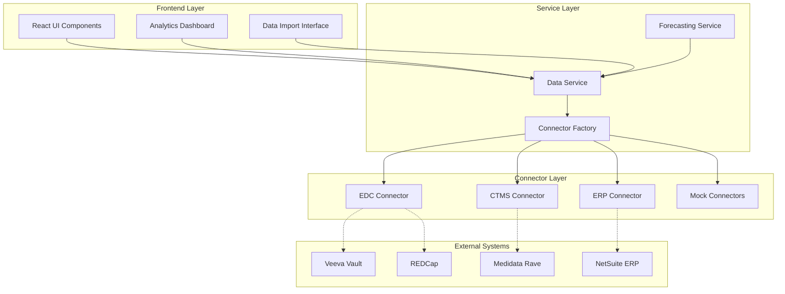

# HypatiaOS Integration Guide

## Overview

This guide provides comprehensive documentation for integrating with HypatiaOS's clinical trial management platform. The system is designed with a modular connector architecture that allows seamless integration with industry-standard systems like EDC, CTMS, and ERP platforms.

## Architecture Overview



## Data Schema Registry

### Core Entities

The platform uses a comprehensive data schema that covers all aspects of clinical trial management:

#### Study Entity
```typescript
interface Study {
  id: string;
  studyId: string; // Protocol identifier
  title: string;
  sponsor: string;
  therapeuticArea: string;
  phase: StudyPhase;
  targetEnrollment: number;
  currentEnrollment: number;
  status: StudyStatus;
  healthScore: number; // 0-100
  // ... additional fields
}
```

#### Site Entity
```typescript
interface Site {
  id: string;
  siteId: string;
  studyId: string;
  siteName: string;
  country: string;
  principalInvestigator: string;
  status: SiteStatus;
  currentEnrollment: number;
  // ... additional fields
}
```

#### Patient Entity
```typescript
interface Patient {
  id: string;
  patientId: string;
  studyId: string;
  siteId: string;
  enrollmentDate: string;
  status: PatientStatus;
  visits: PatientVisit[];
  // ... additional fields
}
```

## Connector Architecture

### Base Connector Interface

All connectors implement the `BaseConnector` interface:

```typescript
interface BaseConnector {
  readonly name: string;
  readonly version: string;
  readonly type: ConnectorType;
  
  connect(): Promise<boolean>;
  disconnect(): Promise<void>;
  isConnected(): boolean;
  healthCheck(): Promise<ConnectorHealth>;
  authenticate(credentials: ConnectorCredentials): Promise<boolean>;
}
```

### EDC Connector Interface

```typescript
interface EDCConnector extends BaseConnector {
  type: 'EDC';
  
  fetchEnrollmentData(studyId: string, options?: FetchOptions): Promise<EnrollmentData[]>;
  fetchPatientData(studyId: string, options?: FetchOptions): Promise<Patient[]>;
  fetchPatientVisitData(studyId: string, patientId?: string): Promise<PatientVisit[]>;
  fetchAdverseEvents(studyId: string): Promise<AdverseEvent[]>;
  getDataCompleteness(studyId: string): Promise<DataCompletenessReport>;
  
  // Real-time subscriptions
  subscribeToEnrollmentUpdates?(studyId: string, callback: (data: EnrollmentData) => void): Promise<string>;
}
```

### CTMS Connector Interface

```typescript
interface CTMSConnector extends BaseConnector {
  type: 'CTMS';
  
  fetchStudyData(studyId: string): Promise<Study>;
  fetchAllStudies(options?: FetchOptions): Promise<Study[]>;
  fetchSiteData(studyId: string, siteId?: string): Promise<Site[]>;
  fetchMonitoringVisits(studyId: string): Promise<MonitoringVisit[]>;
  fetchBudgetUtilization(studyId: string): Promise<BudgetUtilizationReport>;
}
```

### ERP Connector Interface

```typescript
interface ERPConnector extends BaseConnector {
  type: 'ERP';
  
  fetchBudgetData(studyId: string): Promise<Budget[]>;
  fetchPaymentData(studyId: string, siteId?: string): Promise<Payment[]>;
  fetchFinancialSnapshot(studyId: string): Promise<FinancialSnapshot>;
  processPayment(payment: Partial<Payment>): Promise<string>;
  generateInvoice(studyId: string, siteId: string, items: InvoiceItem[]): Promise<string>;
}
```

## Implementation Examples

### Creating a New Connector

#### 1. Implement the Connector Interface

```typescript
// VeevaEDCConnector.ts
import { EDCConnector, ConnectorCredentials, FetchOptions } from '../interfaces';

export class VeevaEDCConnector implements EDCConnector {
  readonly name = 'Veeva Vault EDC Connector';
  readonly version = '1.0.0';
  readonly type = 'EDC' as const;
  
  private apiClient: VeevaAPIClient;
  private connected = false;

  async connect(): Promise<boolean> {
    try {
      this.apiClient = new VeevaAPIClient(this.credentials);
      await this.apiClient.connect();
      this.connected = true;
      return true;
    } catch (error) {
      console.error('Veeva connection failed:', error);
      return false;
    }
  }

  async fetchEnrollmentData(studyId: string, options?: FetchOptions): Promise<EnrollmentData[]> {
    if (!this.connected) {
      throw new Error('Connector not connected');
    }

    const response = await this.apiClient.get(`/studies/${studyId}/enrollment`, {
      params: {
        startDate: options?.startDate,
        endDate: options?.endDate,
        limit: options?.limit,
      },
    });

    return this.transformEnrollmentData(response.data);
  }

  private transformEnrollmentData(veevaData: any[]): EnrollmentData[] {
    return veevaData.map(item => ({
      studyId: item.study_id,
      date: item.enrollment_date,
      cumulativeEnrollment: item.cumulative_count,
      newEnrollments: item.new_count,
      targetEnrollment: item.target_count,
      enrollmentRate: item.enrollment_rate,
    }));
  }

  // ... implement other required methods
}
```

#### 2. Register the Connector in Factory

```typescript
// ConnectorFactory.ts
export class HypatiaConnectorFactory implements ConnectorFactory {
  createEDCConnector(type: string, credentials?: ConnectorCredentials): EDCConnector {
    switch (type.toLowerCase()) {
      case 'veeva':
      case 'veeva-vault':
        return new VeevaEDCConnector(credentials);
      
      case 'medidata':
      case 'rave':
        return new MedidataEDCConnector(credentials);
      
      case 'mock':
      default:
        return new MockEDCConnector();
    }
  }
}
```

#### 3. Configure Environment Variables

```bash
# .env.production
REACT_APP_EDC_CONNECTOR_TYPE=veeva
REACT_APP_EDC_API_KEY=your_veeva_api_key
REACT_APP_EDC_ENDPOINT=https://your-vault.veevavault.com/api/v21.1
```

### Using the Data Service

#### Basic Usage

```typescript
import { dataService } from '../services/DataService';

// Get study data with enriched information
const study = await dataService.getStudy('ONCOLOGY-2024-001');

// Get enrollment trends
const enrollmentData = await dataService.getEnrollmentData('ONCOLOGY-2024-001', {
  startDate: '2024-01-01',
  endDate: '2024-12-31',
});

// Get financial snapshot
const financials = await dataService.getFinancialSnapshot('ONCOLOGY-2024-001');
```

#### Real-time Subscriptions

```typescript
// Subscribe to enrollment updates
const subscriptionId = await dataService.subscribeToEnrollmentUpdates(
  'ONCOLOGY-2024-001',
  (data) => {
    console.log('New enrollment data:', data);
    // Update UI with new data
  }
);

// Unsubscribe when component unmounts
await dataService.unsubscribeFromUpdates(subscriptionId);
```

### Data Import Integration

#### CSV Import with Validation

```typescript
import { ImportDataModal } from '../components/import/ImportDataModal';

// Use the import modal component
<ImportDataModal
  open={importModalOpen}
  onClose={() => setImportModalOpen(false)}
  studyId="ONCOLOGY-2024-001"
/>
```

#### Programmatic Data Import

```typescript
import { dataService } from '../services/DataService';

// Import enrollment data
const enrollmentData = [
  {
    date: '2024-01-15',
    site_id: 'site-001',
    cumulative_enrollment: 25,
    new_enrollments: 3,
  },
  // ... more data
];

const result = await dataService.importStudyData(
  'ONCOLOGY-2024-001',
  enrollmentData,
  'csv-import-enrollment'
);

console.log(`Imported ${result.recordsSuccessful} records`);
```

## AI Forecasting Integration

### Enrollment Forecasting

```typescript
import { forecastingService } from '../services/ForecastingService';

// Generate enrollment forecast
const forecast = await forecastingService.forecastEnrollment('ONCOLOGY-2024-001', 90);

console.log('Predicted completion date:', forecast.completionDate);
console.log('Forecast accuracy:', forecast.accuracy);
console.log('Recommendations:', forecast.recommendations);
```

### Budget Forecasting

```typescript
// Generate budget forecast
const budgetForecast = await forecastingService.forecastBudget('ONCOLOGY-2024-001', 12);

console.log('Projected overrun:', budgetForecast.projectedOverrun);
console.log('Risk level:', budgetForecast.riskLevel);
```

### Timeline Forecasting

```typescript
// Generate timeline forecast
const timelineForecast = await forecastingService.forecastTimeline('ONCOLOGY-2024-001');

console.log('Overall delay:', timelineForecast.overallDelay, 'days');
console.log('Critical milestones:', timelineForecast.milestones.filter(m => m.criticalPath));
```

## Analytics Dashboard Integration

### Using the Analytics Dashboard

```typescript
import { AnalyticsDashboard } from '../components/analytics/AnalyticsDashboard';

// Render dashboard for specific study
<AnalyticsDashboard studyId="ONCOLOGY-2024-001" />

// Render dashboard for all studies
<AnalyticsDashboard />
```

### Custom Analytics Components

```typescript
import { dataService } from '../services/DataService';
import { LineChart, Line, XAxis, YAxis, ResponsiveContainer } from 'recharts';

const CustomEnrollmentChart: React.FC<{ studyId: string }> = ({ studyId }) => {
  const [data, setData] = useState([]);

  useEffect(() => {
    const loadData = async () => {
      const enrollmentData = await dataService.getEnrollmentData(studyId);
      setData(enrollmentData.map(item => ({
        date: new Date(item.date).toLocaleDateString(),
        enrollment: item.cumulativeEnrollment,
      })));
    };
    
    loadData();
  }, [studyId]);

  return (
    <ResponsiveContainer width="100%" height={300}>
      <LineChart data={data}>
        <XAxis dataKey="date" />
        <YAxis />
        <Line type="monotone" dataKey="enrollment" stroke="#3B82F6" />
      </LineChart>
    </ResponsiveContainer>
  );
};
```

## Error Handling and Monitoring

### Connector Health Monitoring

```typescript
import { dataService } from '../services/DataService';

// Check system health
const health = await dataService.getSystemHealth();

if (health.overall !== 'healthy') {
  console.warn('System health issues detected:', health);
  
  // Check individual connector status
  Object.entries(health.connectors || {}).forEach(([name, status]) => {
    if (status.status !== 'healthy') {
      console.error(`Connector ${name} is unhealthy:`, status);
    }
  });
}
```

### Error Boundary Integration

```typescript
import { ErrorBoundary } from '../components/common/ErrorBoundary';

// Wrap components with error boundary
<ErrorBoundary>
  <AnalyticsDashboard studyId="ONCOLOGY-2024-001" />
</ErrorBoundary>
```

## Performance Optimization

### Caching Strategy

The DataService implements intelligent caching:

- **Enrollment data**: 2-minute TTL (frequently changing)
- **Study metadata**: 5-minute TTL (moderately changing)
- **Financial data**: 10-minute TTL (less frequently changing)

### Lazy Loading

```typescript
// Components are lazy-loaded for better performance
const AnalyticsDashboard = React.lazy(() => 
  import('../components/analytics/AnalyticsDashboard')
);

// Use with Suspense
<Suspense fallback={<Loading />}>
  <AnalyticsDashboard studyId="ONCOLOGY-2024-001" />
</Suspense>
```

## Security Considerations

### Authentication

```typescript
// Connectors support multiple authentication methods
const credentials: ConnectorCredentials = {
  apiKey: process.env.REACT_APP_EDC_API_KEY,
  clientId: process.env.REACT_APP_EDC_CLIENT_ID,
  clientSecret: process.env.REACT_APP_EDC_CLIENT_SECRET,
  endpoint: process.env.REACT_APP_EDC_ENDPOINT,
};

const connector = connectorFactory.createEDCConnector('veeva', credentials);
```

### Data Encryption

- All API communications use HTTPS/TLS 1.3
- Sensitive data is encrypted at rest
- API keys are stored in secure environment variables
- Patient data is anonymized and de-identified

## Testing

### Unit Testing Connectors

```typescript
// MockEDCConnector.test.ts
import { MockEDCConnector } from '../mock/MockEDCConnector';

describe('MockEDCConnector', () => {
  let connector: MockEDCConnector;

  beforeEach(() => {
    connector = new MockEDCConnector();
  });

  it('should connect successfully', async () => {
    const result = await connector.connect();
    expect(result).toBe(true);
    expect(connector.isConnected()).toBe(true);
  });

  it('should fetch enrollment data', async () => {
    await connector.connect();
    const data = await connector.fetchEnrollmentData('TEST-001');
    expect(data).toHaveLength(expect.any(Number));
    expect(data[0]).toHaveProperty('studyId', 'TEST-001');
  });
});
```

### Integration Testing

```typescript
// DataService.integration.test.ts
import { dataService } from '../DataService';

describe('DataService Integration', () => {
  it('should aggregate data from multiple connectors', async () => {
    const study = await dataService.getStudy('TEST-001');
    
    expect(study).toHaveProperty('studyId', 'TEST-001');
    expect(study).toHaveProperty('currentEnrollment');
    expect(study).toHaveProperty('budgetUtilization');
  });
});
```

## Deployment Configuration

### Environment-Specific Connectors

```typescript
// config/connectors.ts
export const getConnectorConfig = (): ConnectorConfig => {
  const env = process.env.REACT_APP_ENV || 'development';
  
  switch (env) {
    case 'production':
      return {
        edc: { type: 'veeva', credentials: prodCredentials },
        ctms: { type: 'medidata', credentials: prodCredentials },
        erp: { type: 'netsuite', credentials: prodCredentials },
      };
    
    case 'staging':
      return {
        edc: { type: 'veeva', credentials: stagingCredentials },
        ctms: { type: 'mock', credentials: {} },
        erp: { type: 'mock', credentials: {} },
      };
    
    default:
      return {
        edc: { type: 'mock' },
        ctms: { type: 'mock' },
        erp: { type: 'mock' },
      };
  }
};
```

## Migration Guide

### From Mock to Real Connectors

1. **Update Environment Variables**
   ```bash
   REACT_APP_EDC_CONNECTOR_TYPE=veeva
   REACT_APP_EDC_API_KEY=your_api_key
   ```

2. **No Code Changes Required**
   The connector factory automatically switches implementations based on configuration.

3. **Test Integration**
   ```typescript
   // Verify connector switch
   const connector = connectorFactory.createEDCConnector('veeva');
   const health = await connector.healthCheck();
   console.log('Connector health:', health);
   ```

## Troubleshooting

### Common Issues

#### Connection Failures
```typescript
// Check connector health
const health = await connector.healthCheck();
if (health.status !== 'healthy') {
  console.error('Connection issue:', health.errors);
}
```

#### Data Mapping Issues
```typescript
// Validate data structure
const data = await connector.fetchEnrollmentData('STUDY-001');
console.log('Data structure:', Object.keys(data[0]));
```

#### Performance Issues
```typescript
// Monitor cache performance
console.log('Cache size:', dataService.cache.size);
dataService.clearCache(); // Clear if needed
```

## Support and Resources

### Documentation
- [Component Library](./COMPONENT_LIBRARY.md)
- [Development Guide](./DEVELOPMENT_GUIDE.md)
- [API Reference](./api/README.md)

### Sample Code
- [Connector Examples](../examples/connectors/)
- [Integration Tests](../tests/integration/)
- [Mock Data Generators](../tests/mocks/)

### Community
- GitHub Issues: Report bugs and request features
- Developer Forum: Ask questions and share solutions
- Slack Channel: Real-time support and discussions

---

This integration guide provides the foundation for building robust, scalable integrations with HypatiaOS. The modular architecture ensures that your integrations remain flexible and maintainable as the platform evolves.
