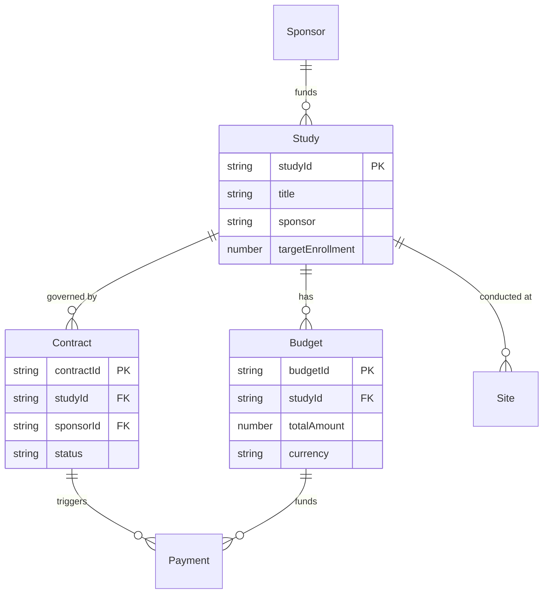

# Master Data Dictionary
**Version**: 1.0  
**Last Updated**: October 19, 2024  
**Maintainer**: Development Team  

---

## 📋 Overview

This document serves as the single source of truth for all data entities, fields, and their definitions across the hypatiaOS platform. Every field must be documented here with its meaning, data type, source, and usage.

---

## 🧩 Entity Overview

| Entity | Status | Primary Use | Key Relationships |
|--------|--------|-------------|-------------------|
| **Study** | ✅ Implemented | Core clinical trial management | → Budget, Contract, Site |
| **Budget** | 🟡 Partial | Financial planning and tracking | ← Study, → Payment |
| **Contract** | 🟡 Schema Only | Legal agreements and terms | ← Study, → Budget |
| **Payment** | 🔴 Planned | Financial transactions | ← Budget, ← Contract |
| **Site** | 🟡 Partial | Clinical sites and locations | ← Study |
| **Sponsor** | 🟡 Partial | Funding organizations | → Study, → Contract |

---

## 📊 Complete Field Dictionary

### **Study Entity**
*Primary entity for clinical trial management*

| Field Name | Description | Type | Source | Required | Default | Validation | Example | UI Display |
|------------|-------------|------|--------|----------|---------|------------|---------|------------|
| `id` | Internal unique identifier | Number | Auto-generated | ✅ | Auto-increment | Positive integer | 1 | Hidden |
| `studyId` | Protocol identifier | String | Manual/CTMS | ✅ | — | 5-50 chars, alphanumeric + dash | "ONCOLOGY-2024-001" | Primary display |
| `title` | Official study name | String | Manual/CTMS | ✅ | — | 10-500 chars | "Phase III Oncology Trial - Advanced Lung Cancer" | Card title |
| `sponsor` | Funding organization | String | Manual/CRM | ✅ | — | 2-100 chars | "BioPharma Corp" | Avatar + name |
| `therapeuticArea` | Medical specialty | String | Manual | ✅ | — | Enum: Oncology, Cardiology, etc. | "Oncology" | Chip/tag |
| `phase` | Clinical trial phase | String | Manual | ✅ | — | Enum: Phase I-IV, Pivotal, RWE | "Phase III" | Color-coded chip |
| `targetEnrollment` | Planned patient count | Number | Manual/Protocol | ✅ | 0 | 1-10000 | 500 | Progress denominator |
| `currentEnrollment` | Enrolled patients | Number | EDC/Manual | ✅ | 0 | 0 to targetEnrollment | 342 | Progress numerator |
| `enrollmentProgress` | Enrollment percentage | Number | Calculated | ❌ | Calculated | 0-100 | 68.4 | Progress bar |
| `sitesActivated` | Active sites count | Number | Manual/CTMS | ✅ | 0 | 0 to totalSites | 12 | Fraction numerator |
| `totalSites` | Planned sites count | Number | Manual | ✅ | 1 | 1-1000 | 15 | Fraction denominator |
| `medianCTADays` | Contract execution time | Number | Calculated | ❌ | 0 | 0-365 | 18 | Efficiency metric |
| `finalizedBudget` | Approved budget amount | Number | FOE/Manual | ❌ | 0 | 0+ | 2500000 | Currency display |
| `estimatedBudget` | Initial budget estimate | Number | Manual | ❌ | 0 | 0+ | 2300000 | Comparison baseline |
| `budgetVariance` | Budget change percentage | Number | Calculated | ❌ | 0 | -100 to +∞ | 8.7 | Variance indicator |
| `completedPayments` | Paid amount to date | Number | FOE/ERP | ❌ | 0 | 0+ | 1250000 | Payment tracking |
| `pendingPayments` | Approved unpaid amount | Number | FOE | ❌ | 0 | 0+ | 320000 | Cash flow |
| `budgetUtilization` | Budget used percentage | Number | Calculated | ❌ | 0 | 0-200 | 62.8 | Progress bar |
| `ctaStatus` | Contract status | String | Manual/FOE | ✅ | "Draft" | Enum: Draft, In Negotiation, Executed | "Executed" | Status chip |
| `healthScore` | AI-calculated health | Number | AI Engine | ❌ | 50 | 0-100 | 85 | Health indicator |
| `healthIndicator` | Health status category | String | AI Engine | ❌ | "warning" | Enum: good, warning, critical | "good" | Color/emoji |
| `lastUpdated` | Last modification time | String | System | ✅ | NOW() | ISO 8601 | "2024-10-18T14:30:00Z" | Relative time |
| `forecastedCompletion` | Predicted end date | String | AI Engine | ❌ | — | ISO 8601 date | "2025-08-15" | Date display |
| `protocolDeviations` | Deviation count | Number | EDC/Manual | ❌ | 0 | 0+ | 3 | Alert counter |
| `queryResolutionTime` | Avg query resolution | Number | EDC | ❌ | 0 | 0+ | 4.2 | Performance metric |
| `auditFindings` | Open audit issues | Number | Audit System | ❌ | 0 | 0+ | 1 | Compliance metric |
| `geography` | Study regions | Array | Manual | ❌ | [] | Array of country codes | ["US", "EU", "APAC"] | Region chips |
| `currency` | Primary currency | String | Manual/Sponsor | ✅ | "USD" | ISO 4217 | "USD" | Currency symbol |

### **Budget Entity**
*Financial planning and tracking*

| Field Name | Description | Type | Source | Required | Default | Validation | Example | Notes |
|------------|-------------|------|--------|----------|---------|------------|---------|-------|
| `budgetId` | Unique budget identifier | String | Auto-generated | ✅ | Auto | Format: BUD-YYYY-NNN | "BUD-2024-001" | Links to contracts |
| `studyId` | Associated study | String | Foreign Key | ✅ | — | Must exist in studies | "ONCOLOGY-2024-001" | Parent relationship |
| `totalAmount` | Total budget value | Number | Manual/Template | ✅ | 0 | 0+ | 2500000 | Base currency |
| `currency` | Budget currency | String | Manual/Sponsor | ✅ | "USD" | ISO 4217 | "USD" | Exchange rate applied |
| `status` | Budget approval status | String | Manual/Workflow | ✅ | "Draft" | Enum: Draft, Submitted, Approved | "Approved" | Workflow state |
| `createdAt` | Creation timestamp | String | System | ✅ | NOW() | ISO 8601 | "2024-01-15T10:00:00Z" | Audit trail |
| `approvedBy` | Approver user ID | String | Workflow | ❌ | — | Valid user ID | "user-123" | Authorization |

### **Contract Entity**
*Legal agreements and terms*

| Field Name | Description | Type | Source | Required | Default | Validation | Example | Notes |
|------------|-------------|------|--------|----------|---------|------------|---------|-------|
| `contractId` | Unique contract identifier | String | Auto-generated | ✅ | Auto | Format: CTA-YYYY-NNN | "CTA-2024-001" | Primary key |
| `studyId` | Associated study | String | Foreign Key | ✅ | — | Must exist in studies | "ONCOLOGY-2024-001" | Parent relationship |
| `sponsorId` | Contracting sponsor | String | Foreign Key | ✅ | — | Valid organization ID | "org-sponsor-123" | Legal entity |
| `croId` | Contracting CRO | String | Foreign Key | ✅ | — | Valid organization ID | "org-cro-456" | Service provider |
| `contractType` | Type of agreement | String | Manual | ✅ | — | Enum: MSA, Study, Site, Amendment | "Study" | Legal category |
| `status` | Contract status | String | Workflow | ✅ | "Draft" | Enum: Draft, Negotiating, Executed | "Executed" | Execution state |
| `effectiveDate` | Contract start date | String | Manual | ❌ | — | ISO 8601 date | "2024-01-01" | Legal validity |
| `expirationDate` | Contract end date | String | Manual | ❌ | — | ISO 8601 date | "2025-12-31" | Legal validity |
| `signedDate` | Execution timestamp | String | eSignature | ❌ | — | ISO 8601 | "2024-01-15T14:30:00Z" | Legal binding |

---

## 🔗 Data Relationships

### **Primary Relationships**


### **Data Flow Dependencies**
1. **Study Creation** → Triggers budget template generation
2. **Budget Approval** → Enables contract creation
3. **Contract Execution** → Activates payment milestones
4. **EDC Events** → Update enrollment and trigger payments
5. **Payment Processing** → Updates budget utilization

---

## 📊 Calculated Fields

### **Enrollment Progress**
```typescript
enrollmentProgress = (currentEnrollment / targetEnrollment) * 100
```

### **Budget Utilization**
```typescript
budgetUtilization = ((completedPayments + pendingPayments) / finalizedBudget) * 100
```

### **Budget Variance**
```typescript
budgetVariance = ((finalizedBudget - estimatedBudget) / estimatedBudget) * 100
```

### **Health Score Algorithm**
```typescript
healthScore = weightedAverage([
  enrollmentProgress * 0.3,
  (100 - budgetVariance) * 0.25,
  ctaExecutionEfficiency * 0.2,
  dataQualityScore * 0.15,
  complianceScore * 0.1
])
```

---

## 🎯 Data Quality Rules

### **Validation Rules**
1. **Study ID**: Must be unique across all studies
2. **Enrollment**: Current ≤ Target enrollment
3. **Budget**: Utilization should not exceed 110% without approval
4. **Dates**: End date must be after start date
5. **Currency**: Must be valid ISO 4217 code

### **Business Rules**
1. **Study Status**: Cannot move from "Completed" to "Active"
2. **Budget Approval**: Required before contract execution
3. **Payment Limits**: Cannot exceed approved budget without amendment
4. **Site Activation**: Requires executed contract

---

## 🔄 Update Process

### **Maintenance Schedule**
- **Weekly**: Review new fields added to codebase
- **Monthly**: Validate field usage and update examples
- **Quarterly**: Full audit of field definitions and relationships

### **Change Management**
1. **Propose Change**: Create issue with field modification request
2. **Impact Analysis**: Review all dependent systems and documentation
3. **Approval**: Technical lead and data governance team approval
4. **Implementation**: Update code, documentation, and validation rules
5. **Communication**: Notify all stakeholders of changes

---

**This master data dictionary is a living document that must be updated with every schema change or new field addition. It serves as the authoritative source for all data definitions across the hypatiaOS platform.**
