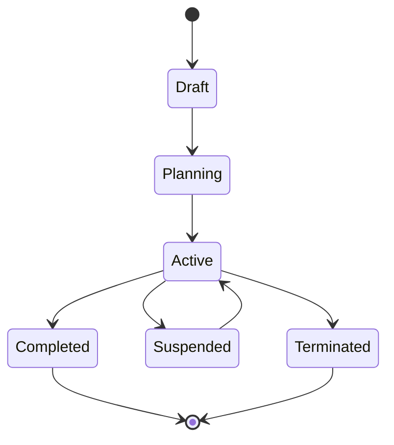

# Study Entity Documentation

## Description
The `Study` object represents a clinical study managed by the CRO. It acts as the parent entity for Budgets, Contracts, Forecasting, and Payments. This is the core entity around which all clinical trial operations are organized.

---

## Field Map

| Field Name | Description | Type | Source | Required | Dependencies | Example |
|-------------|--------------|------|----------|-----------|---------------|----------|
| `id` | Internal system identifier | Number | Auto-generated | ✅ | None | 1 |
| `studyId` | Protocol identifier (business key) | String | Manual/CTMS | ✅ | Unique constraint | "ONCOLOGY-2024-001" |
| `title` | Official name of the clinical trial | String | Manual/CTMS | ✅ | None | "Phase III Oncology Trial - Advanced Lung Cancer" |
| `sponsor` | Organization funding the study | String | Manual/CRM | ✅ | Must exist in organizations | "BioPharma Corp" |
| `therapeuticArea` | Disease area being studied | String | Manual | ✅ | Predefined list | "Oncology" |
| `phase` | Clinical trial phase | String | Manual | ✅ | Enum validation | "Phase III" |
| `targetEnrollment` | Planned number of patients | Number | Manual/Protocol | ✅ | Must be > 0 | 500 |
| `currentEnrollment` | Currently enrolled patients | Number | EDC/IRT | ✅ | ≤ targetEnrollment | 342 |
| `enrollmentProgress` | Enrollment percentage | Number | Calculated | ❌ | Auto-calculated | 68.4 |
| `sitesActivated` | Number of active sites | Number | Manual/CTMS | ✅ | ≤ totalSites | 12 |
| `totalSites` | Total planned sites | Number | Manual | ✅ | Must be > 0 | 15 |
| `medianCTADays` | Median contract execution time | Number | Calculated | ❌ | Contract data | 18 |
| `finalizedBudget` | Approved study budget | Number | FOE/Manual | ❌ | Currency validation | 2500000 |
| `estimatedBudget` | Initial budget estimate | Number | Manual | ❌ | Currency validation | 2300000 |
| `budgetVariance` | Budget change percentage | Number | Calculated | ❌ | Budget fields | 8.7 |
| `completedPayments` | Total payments made | Number | FOE/ERP | ❌ | ≥ 0 | 1250000 |
| `pendingPayments` | Approved unpaid amounts | Number | FOE | ❌ | ≥ 0 | 320000 |
| `budgetUtilization` | Budget usage percentage | Number | Calculated | ❌ | Payment fields | 62.8 |
| `ctaStatus` | Contract execution status | String | Manual/FOE | ✅ | Enum validation | "Executed" |
| `healthScore` | AI-calculated study health | Number | AI Engine | ❌ | 0-100 range | 85 |
| `healthIndicator` | Health status category | String | AI Engine | ❌ | Enum validation | "good" |
| `lastUpdated` | Last modification timestamp | String | System | ✅ | ISO 8601 format | "2024-10-18T14:30:00Z" |
| `forecastedCompletion` | Predicted completion date | String | AI Engine | ❌ | Date format | "2025-08-15" |
| `protocolDeviations` | Number of deviations | Number | EDC/Manual | ❌ | ≥ 0 | 3 |
| `queryResolutionTime` | Average query resolution days | Number | EDC | ❌ | ≥ 0 | 4.2 |
| `auditFindings` | Open audit issues | Number | Audit System | ❌ | ≥ 0 | 1 |
| `geography` | Study regions | Array | Manual | ❌ | Country codes | ["US", "EU", "APAC"] |
| `currency` | Primary currency | String | Manual/Sponsor | ✅ | ISO 4217 | "USD" |

---

## Data Sources

### Primary Sources
| Source System | Fields Provided | Update Frequency | Integration Method |
|---------------|-----------------|------------------|-------------------|
| **Manual Entry** | studyId, title, sponsor, phase, targetEnrollment | One-time/Ad-hoc | Web UI |
| **CTMS Integration** | title, phase, sitesActivated, totalSites | Daily sync | REST API |
| **EDC/IRT System** | currentEnrollment, protocolDeviations, queryResolutionTime | Real-time | Webhooks |
| **FOE (Financial Orchestration)** | finalizedBudget, completedPayments, pendingPayments | Hourly | Internal API |
| **AI Engine** | healthScore, healthIndicator, forecastedCompletion | Daily batch | Internal service |
| **Audit System** | auditFindings, lastUpdated | Real-time | Event stream |

### Calculated Fields
| Field | Formula | Dependencies | Update Trigger |
|-------|---------|--------------|----------------|
| `enrollmentProgress` | `(currentEnrollment / targetEnrollment) * 100` | currentEnrollment, targetEnrollment | Enrollment change |
| `budgetVariance` | `((finalizedBudget - estimatedBudget) / estimatedBudget) * 100` | finalizedBudget, estimatedBudget | Budget update |
| `budgetUtilization` | `((completedPayments + pendingPayments) / finalizedBudget) * 100` | Payment fields, finalizedBudget | Payment change |

---

## Business Rules

### Validation Rules
1. **Study ID Uniqueness**: `studyId` must be unique across all studies
2. **Enrollment Limits**: `currentEnrollment` ≤ `targetEnrollment`
3. **Site Limits**: `sitesActivated` ≤ `totalSites`
4. **Budget Consistency**: `completedPayments` + `pendingPayments` ≤ `finalizedBudget * 1.1` (10% tolerance)
5. **Date Validation**: `forecastedCompletion` must be future date
6. **Currency Format**: Must be valid ISO 4217 currency code

### State Transitions


### Health Score Calculation
```typescript
healthScore = calculateWeightedAverage([
  { metric: enrollmentProgress, weight: 0.30 },
  { metric: budgetCompliance, weight: 0.25 },
  { metric: ctaExecutionEfficiency, weight: 0.20 },
  { metric: dataQualityScore, weight: 0.15 },
  { metric: complianceScore, weight: 0.10 }
]);

healthIndicator = 
  healthScore >= 80 ? 'good' :
  healthScore >= 60 ? 'warning' : 'critical';
```

---

## API Endpoints

### Core Operations
```typescript
// Get study details
GET /api/studies/{studyId}
Response: Study

// Update study
PUT /api/studies/{studyId}
Body: Partial<Study>
Response: Study

// Create new study
POST /api/studies
Body: CreateStudyRequest
Response: Study

// List studies with filters
GET /api/studies?sponsor={sponsor}&phase={phase}&status={status}
Response: Study[]
```

### Related Operations
```typescript
// Get study budget
GET /api/studies/{studyId}/budget
Response: Budget

// Get study contracts
GET /api/studies/{studyId}/contracts
Response: Contract[]

// Get study sites
GET /api/studies/{studyId}/sites
Response: Site[]

// Get study metrics
GET /api/studies/{studyId}/metrics
Response: StudyMetrics
```

---

## UI Display Mapping

### Studies Portfolio View
| UI Element | Field Mapping | Display Format |
|------------|---------------|----------------|
| **Card Title** | `studyId` | Bold, primary text |
| **Card Subtitle** | `title` | Secondary text, truncated |
| **Sponsor Avatar** | `sponsor` (first letter) | Circular avatar |
| **Phase Chip** | `phase` | Color-coded chip |
| **Health Indicator** | `healthIndicator` | Emoji (🟢🟡🔴) |
| **Enrollment Progress** | `enrollmentProgress` | Progress bar + percentage |
| **Budget Progress** | `budgetUtilization` | Progress bar + percentage |
| **Sites Status** | `sitesActivated/totalSites` | Fraction display |
| **Last Updated** | `lastUpdated` | Relative time (e.g., "2 hours ago") |

### Study Detail View
| Section | Fields Displayed | Format |
|---------|------------------|--------|
| **Header** | `studyId`, `title`, `sponsor`, `phase` | Large text, badges |
| **Key Metrics** | `healthScore`, `enrollmentProgress`, `budgetUtilization` | Large numbers, progress bars |
| **Timeline** | `forecastedCompletion`, `lastUpdated` | Date formatting |
| **Alerts** | `protocolDeviations`, `auditFindings` | Alert chips if > 0 |
| **Financial** | `finalizedBudget`, `completedPayments`, `pendingPayments` | Currency formatting |

---

## Data Quality Monitoring

### Critical Metrics
- **Completeness**: Required fields populated (target: 100%)
- **Accuracy**: Data validation rules passed (target: 99.5%)
- **Timeliness**: Updates within SLA (target: < 1 hour for critical fields)
- **Consistency**: Cross-system data alignment (target: 99%)

### Monitoring Alerts
1. **Missing Required Data**: Alert if required fields are null
2. **Data Inconsistency**: Alert if calculated fields don't match
3. **Stale Data**: Alert if `lastUpdated` > 24 hours for active studies
4. **Business Rule Violations**: Alert on validation failures

---

## Integration Points

### Upstream Systems (Data Providers)
- **CTMS**: Study metadata, site information
- **EDC**: Enrollment data, protocol deviations
- **Financial Systems**: Budget and payment information
- **Contract Management**: CTA status and execution data

### Downstream Systems (Data Consumers)
- **Reporting Dashboard**: All study metrics
- **Analytics Engine**: Historical trend analysis
- **Notification System**: Alert generation
- **Export Services**: Regulatory reporting

---

## Change History

| Version | Date | Changes | Author |
|---------|------|---------|--------|
| 1.0 | 2024-10-19 | Initial documentation based on StudiesPage.tsx implementation | Technical Team |

---

## Notes
- `protocol_id` must be unique across all studies in the system
- `study_status` should be automatically updated from EDC integration when enabled
- Health score algorithm may be adjusted based on business requirements
- All monetary fields are stored in the study's primary currency
- Geographic regions use ISO 3166-1 alpha-2 country codes

---

**This entity serves as the foundation for all clinical trial operations and must maintain high data quality standards for accurate reporting and decision-making.**
